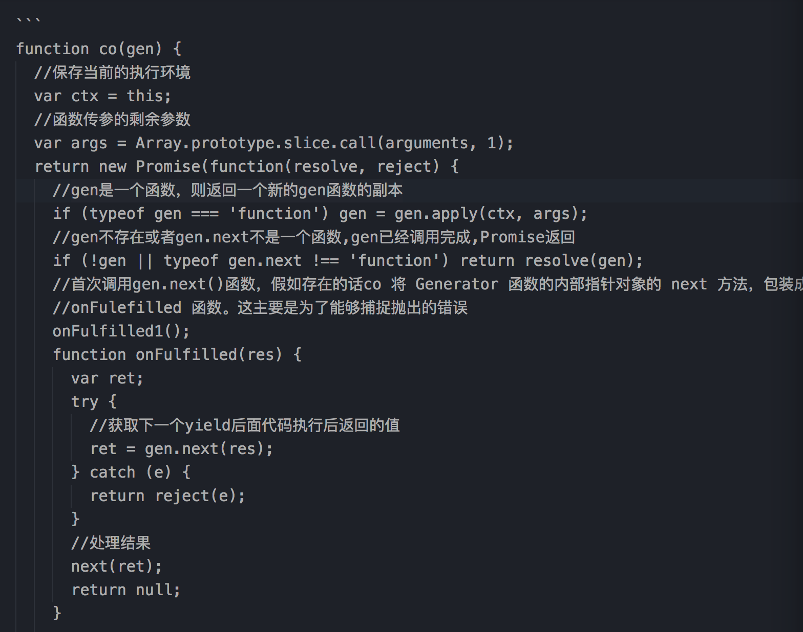
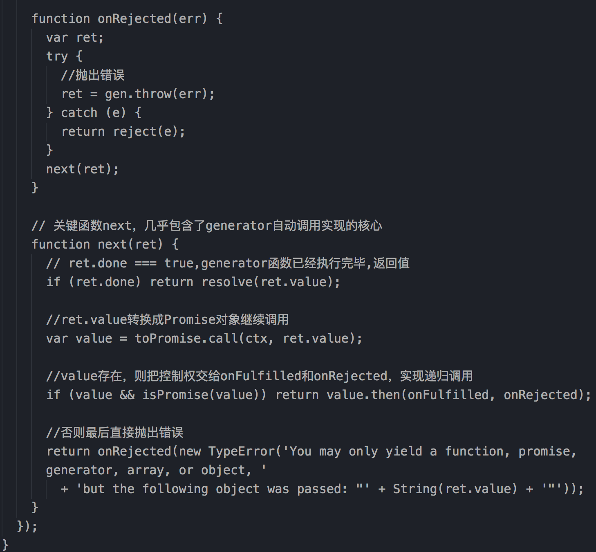

### 一道题
```
async function async1(){
  console.log('1')
  await async2()
  console.log('2')
}
async function async2(){
  console.log('3')
}
console.log('4')
setTimeout(function(){
  console.log('5') 
},0)  
async1();
new Promise(function(resolve){
  console.log('6')
  resolve();
}).then(function(){
  console.log('7')
})
console.log('8')
```

### 理解async/await
回调函数，事件监听，事件订阅，到 Promise 对象，再到 Generator 函数，追求解决回调地狱的问题
```
回调函数
getData( a => {
    getTwoData( a, b => {
        getThreeData( b,c => {
            getFourData( c, d => {
                console.log('终于嵌套完了')
            })
        })
    })
})

Promise改进后
getData().then( a => {
    return getTwoData(a)
}).then( b => {
    return getThreeData(a)
}).then( c => {
    return getFourData(c)
})

Generator 
function* helloWorldGenerator() {
  yield 'hello';
  yield 'world';
  return 'ending';
}
var hw = helloWorldGenerator();
hw.next()
hw.next()
hw.next()

Generator 改进后+ co 模块
const co = require('co');
const gen = co(function* () {
  const a = yield getData();
  const b = yield getTwoData();
  const c = yield getThreeData();
  const d = yield getFourData();
});

async/await 改进后
async () => {
    const a = await getData()
    const b = await getTwoData()
    const c = await getThreeData()
    const d = await getFourData()
    console.log(d)
}
```
#### async
async/await可以说是co模块和生成器函数的语法糖。用更加清晰的语义解决js异步代码。
使用 async / await, 搭配 promise, 可以通过编写形似同步的代码来处理异步流程, 提高代码的简洁性和可读性
[Promise实现](http://www.charlycheng.xyz/2018/04/19/promise:A+%E6%BA%90%E7%A0%81%E5%AE%9E%E7%8E%B0%E5%8F%8A%E5%B9%B3%E6%97%B6%E5%B8%B8%E8%A7%81%E9%97%AE%E9%A2%98/)
```
async function fn(args) {
  
}

// 等同于
function fn(args) {
  return  sp(function* () {
    
  });
}
function sp(genF) {
  return new Promise(function(resolve, reject) {
    const gen = genF();
    function step(nextF) {
      let next;
      try {
        next = nextF();
      } catch(e) {
        return reject(e);
      }
      if(next.done) {
        return resolve(next.value);
      }
      Promise.resolve(next.value).then(function(v) {
        step(function() { return gen.next(v); });
      }, function(e) {
        step(function() { return gen.throw(e); });
      });
    }
    step(function() { return gen.next(undefined); });
  });
}
```

async函数会返回一个Promise对象
    -- async函数中是return一个值，这个值就是Promise对象中resolve的值；
    -- async函数中是throw一个值，这个值就是Promise对象中reject的值。
```
const imAsync = async (num) => {
  if (num > 0) {
    return num // 这里相当于resolve(num)
  } else {
    throw num // 这里相当于reject(num)
  }
}

imAsync(1).then( v => {
  console.log(v);
});

// 注意这里是catch
imAsync(0).catch( v => {
  console.log(v);
})
```

```
const imAsync1 =  (num) => {
  return new Promise ( (resolve, reject) => {
        if (num > 0) {
            resolve(num)
        } else {
            reject(num)
        }
  })
}

imAsync1(1).then( v => {
  console.log(v);
});

imAsync1(0).catch( v => {
  console.log(v);
})
```
#### await 
await会暂停当前async函数的执行，等待Promise的计算结果返回以后再继续执行当前的async函数
    -- await 等待的不是所有的异步操作，等待的只是Promise
    -- await命令后面是一个thenable对象（即定义then方法的对象），那么await会将其等同于 Promise 对象
    -- 任何一个await语句后面的 Promise 对象变为reject状态，那么整个async函数都会中断执行
```
const awaitTest = async () => {
  console.log(1);  
  await setTimeout(function () {
    console.log(2);
  }, 1000);
  console.log(3);
}
awaitTest()

const awaitTest = async () => {
  console.log(1);  
  await new Promise ( (resolve, reject) => {
    setTimeout(function () {
        console.log(2);
        console.time('beigin')
        resolve()
    }, 1000);
  })
  console.timeEnd('beigin')
  console.log(3);
}
awaitTest()
```

### async函数对 Generator函数的改进
（1）内置执行器
Generator 函数的执行必须靠执行器，所以才有了co模块，而async函数自带执行器。也就是说，
（2）更好的语义
（3）更广的适用性
（4）返回值是 Promise

await用于一个异步操作之前，表示要“等待”这个异步操作的返回值。await也可以用于一个同步的值。
co 函数库其实就是将两种自动执行器（Thunk 函数和 Promise 对象），包装成一个库
接受 Generator 函数作为参数，返回一个 Promise 对象，不用编写 Generator 函数的执行器



toPromise
通过判定参数的类型，然后再通过转移控制权给不同的参数处理函数，从而获取到期望返回的值。
```
function toPromise(obj) {
  if (!obj) return obj;
  if (isPromise(obj)) return obj;
  if (isGeneratorFunction(obj) || isGenerator(obj)) return co.call(this, obj);
  if ('function' == typeof obj) return thunkToPromise.call(this, obj);
  if (Array.isArray(obj)) return arrayToPromise.call(this, obj);
  if (isObject(obj)) return objectToPromise.call(this, obj);
  return obj;
}
function objectToPromise(obj){
  //获取一个和传入的对象一样构造器的对象
  var results = new obj.constructor();
  //获取对象的所有可以遍历的key
  var keys = Object.keys(obj);
  var promises = [];
  for (var i = 0; i < keys.length; i++) {
    var key = keys[i];
    //每一个项都调用一次toPromise方法，变成Promise对象
    var promise = toPromise.call(this, obj[key]);
    //如果里面是Promise对象的话，则取出e里面resolved后的值
    if (promise && isPromise(promise)) defer(promise, key);
    else results[key] = obj[key];
  }
  //并行，按顺序返回结果，返回一个数组
  return Promise.all(promises).then(function () {
    return results;
  });

  function defer(promise, key) {
    results[key] = undefined;
    promises.push(promise.then(function (res) {
      results[key] = res;
    }));
  }
}
function thunkToPromise(fn) {
  var ctx = this;
  return new Promise(function (resolve, reject) {
    fn.call(ctx, function (err, res) {
      if (err) return reject(err);
      if (arguments.length > 2) res = slice.call(arguments, 1);
      resolve(res);
    });
  });
}
function arrayToPromise(obj) {
  return Promise.all(obj.map(toPromise, this));
}

function isPromise(obj) {
  return 'function' == typeof obj.then;
}
function isGenerator(obj) {
  return 'function' == typeof obj.next && 'function' == typeof obj.throw;
}
function isGeneratorFunction(obj) {
  var constructor = obj.constructor;
  if (!constructor) return false;
  if ('GeneratorFunction' === constructor.name || 'GeneratorFunction' === constructor.displayName) return true;
  return isGenerator(constructor.prototype);
}
function isObject(val) {
  return Object == val.constructor;
}
```

### async/await 错误处理

```
async function f() {
  await Promise.reject('出错了');
}

f()
.then(v => console.log('1', v))
.catch(e => console.log('错误', e))
// 出错了
```

```
async function f() {
  let a = await Promise.reject('hello world1');
  let b = await Promise.resolve('hello world2'); // 不会执行
  console.log(a, b)
}
f()
.then(v => console.log('1', v))
.then(v => console.log('2', v))
.catch(e => console.log('错误', e))
```

```
async function f() {
  try {
    await Promise.reject('出错了');
  } catch(e) {
  }
  return await Promise.resolve('hello world');
}

f()
.then(v => console.log(v))
```
```
async function f() {
  await Promise.reject('出错了')
    .catch(e => console.log(e));
  return await Promise.resolve('hello world');
}

f()
.then(v => console.log(v))
// 出错了
// hello world
```

如果有多个await命令，可以统一放在try...catch结构中。
```
async function main() {
  try {
    const val1 = await Promise.reject('出错了');
    const val2 = await Promise.resolve('爱你1');
    const val3 = await Promise.resolve('爱你2');

    console.log('Final: ', val2);
  }
  catch (err) {
    console.error('error', err);
  }
}
main()
```

try...catch结构，实现多次重复尝试

```
const NUM_RETRIES = 3;
async function test() {
  let i;
  for (i = 0; i < NUM_RETRIES; ++i) {
    try {
      await Promise.resolve('出错了');
      break;
    } catch(err) {}
  }
  console.log(i);
}

test();
```

多个await命令后面的异步操作，如果不存在继发关系，最好让它们同时触发
```
let [foo, bar] = await Promise.all([getFoo(), getBar()]);
```